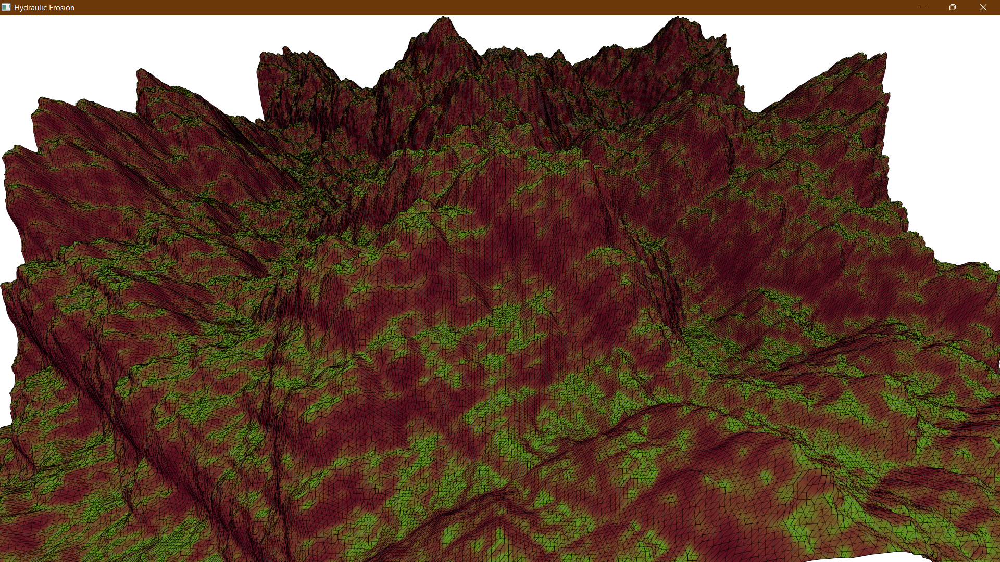
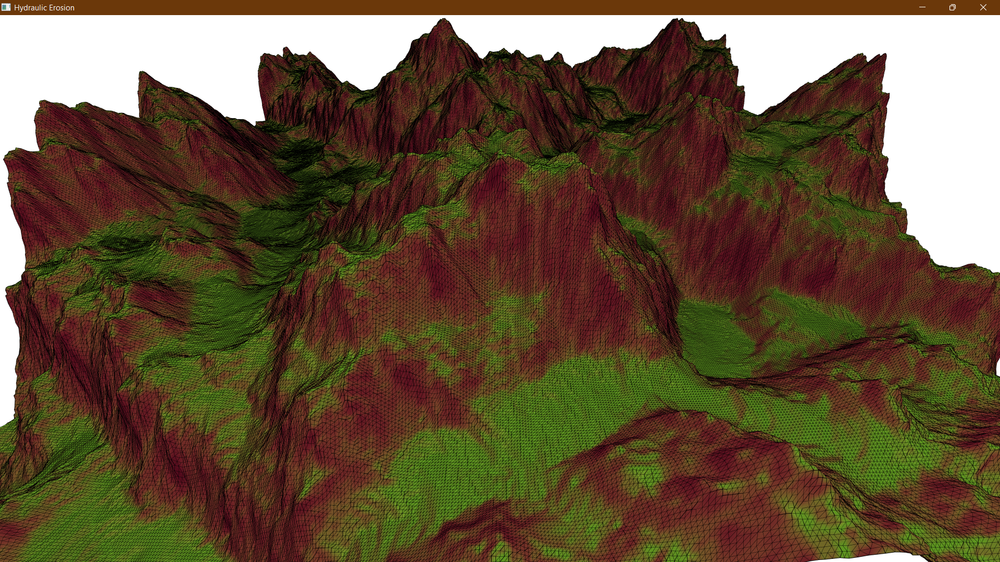

# Hydraulic Erosion Simulation

A hydraulic erosion simulation written in c99 based on Hans Beyer's paper.

## About

This is a hydraulic erosion simulator written in C implementing Hans Beyers hydraulic erosion algorythm. It uses OpenGL and GLFW for the graphics, encapsulated in my own custom API based on the [sokol-headers](https://github.com/floooh/sokol).

## Screenshots

| Before                                            | After                                           |
| ------------------------------------------------- | ----------------------------------------------- |
|  |  |

## Running

| Platform    | Support                     | Notes                          |
| ----------- | --------------------------- | ------------------------------ |
| Windows x64 | :heavy_check_mark: Yes      |                                |
| Windows x86 | N/A                         |                                |
| Linux x64   | :heavy_check_mark: Yes      |                                |
| Linux x86   | N/A                         |                                |
| MacOS       | :heavy_multiplication_x: No | MacOS does not support OpenGL. |

To build and run this project, you will first have to download it localy. Use either git or download it directly from github.

If you use git to clone this repository, use the following command to make sure you get the all the dependencies as well.

```
git clone https://github.com/jovialen/hydraulic_erosion.git --recursive
```

You can then use the build scripts in the repository root to build the project

| Target  | Description                                                      |
| ------- | ---------------------------------------------------------------- |
| release | Build the release version of the project.                        |
| debug   | Build the debug version of the project. Has a terrain wireframe. |

### Linux

```
sh build_linux.sh <target>
```

### Windows

```
.\build_win32.bat <target>
```

## See also

- [Hans Beyers paper on hydraulic erosion](Implementation%20of%20a%20method%20for%20hydraulic%20erosion.pdf)
- [Sebastian Lague's video](https://www.youtube.com/watch?v=eaXk97ujbPQ)
